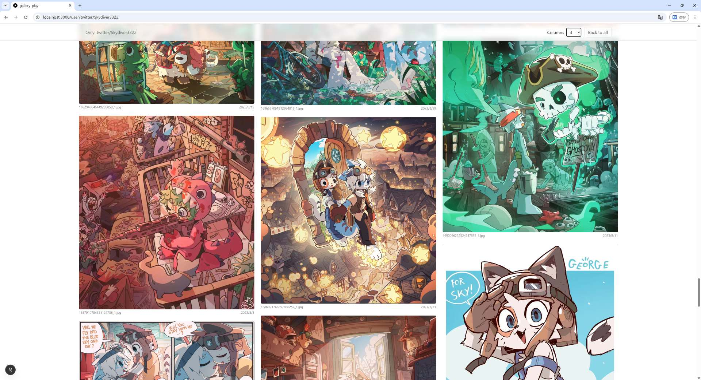
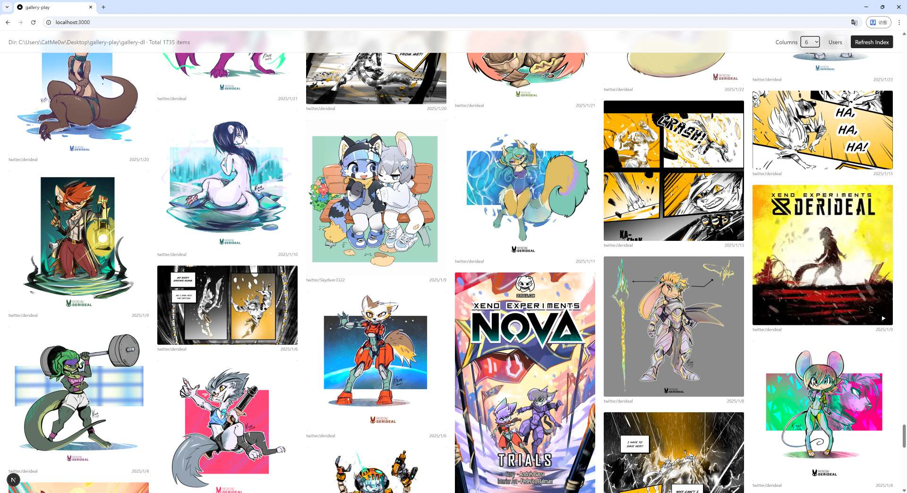
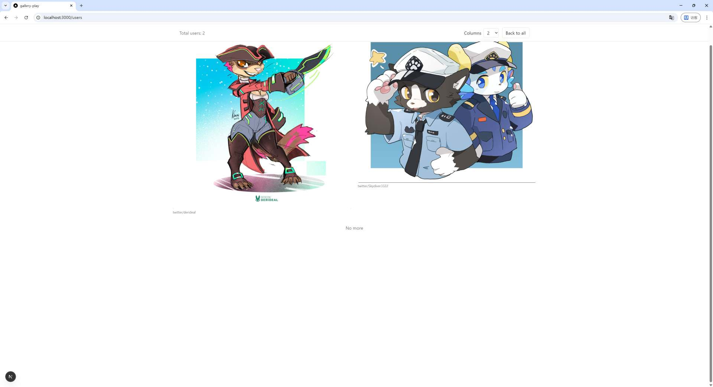

# gallery-play

Filesystem-based image/video browser for a [gallery-dl](https://github.com/mikf/gallery-dl) download directory.







_Credits: [Sky Diver](https://twitter.com/Skydiver3322), [Kiaun](https://twitter.com/derideal)_

## Usage

1) Prepare your gallery directory (for example, the default gallery-dl layout):

```
<GALLERY_DIR>/twitter/USERNAME/ID_1.jpg
<GALLERY_DIR>/flickr/USERNAME/ID_2.png
...
```

2) Create `.env.local` at the project root and set the absolute path to your gallery directory.  
If not set, the default is `<projectRoot>/gallery-dl`.

```
GALLERY_DIR=C:\\Users\\<you>\\Pictures\\gallery-dl
```

3) (If your gallery directory contains videos) Install [ffmpeg](https://www.ffmpeg.org/download.html) and ensure it's in your PATH.  
Both `ffmpeg` and `ffprobe` must be available.

4) Start the server:

```
npm run build
npm start
```

Open http://localhost:3000 to browse.

## Notes

- Local-only usage: there is no CORS or auth hardening for public exposure. Do not expose directly to the Internet.
- Initial scan time depends on total files. If you make changes to the gallery directory, click "Refresh Index" to rescan.
- Set `NEXT_PUBLIC_BASE_PATH` in `.env.local` if you want to serve from a subpath (e.g. behind a reverse proxy).

## License

MIT License
